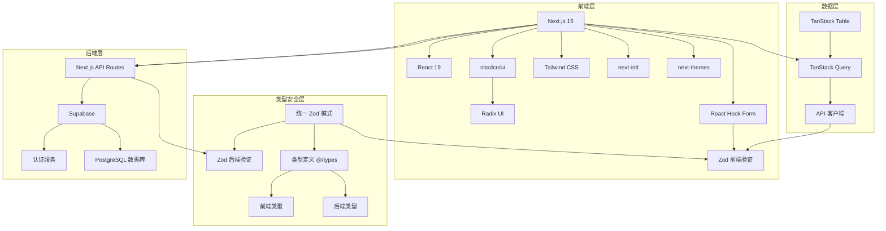

# Next.js Template

这是一个基于 Next.js 主流开发框架的项目模板，用于快速启动全栈应用开发。

## 核心技术栈



## 技术选型

- [Next.js 15](https://nextjs.org/)
  前后端框架
- [Supabase](https://supabase.com/)
  数据库
- [TanStack Query](https://tanstack.com/query/v5/)
  数据获取与缓存
- [TanStack Table](https://tanstack.com/table/v8/)
  表格渲染
- [shadcn/ui](https://ui.shadcn.com/)(基于 Radix UI)
  UI组件
- [Tailwind CSS](https://tailwindcss.com/)
  样式
- [React Hook Form](https://react-hook-form.com/)
  表单处理
- [Zod](https://zod.dev/)
  类型验证
- [next-intl](https://next-intl.dev/)
  国际化

## 启动指南

如果你希望自己独立运行 Supabase，确保你的本地环境安装有 Docker，然后运行以下命令启动 Supabase：

```bash
pnpm i supabase --save-dev
supabase init
supabase start
```

如果你有测试环境，则修改 `.env.development` 文件中的 Supabase 配置。

```env
NEXT_PUBLIC_SUPABASE_URL=http://localhost:54321
NEXT_PUBLIC_SUPABASE_ANON_KEY=控制台输出的 KEY
```

然后运行以下命令启动 Next.js 应用：

```bash
pnpm install
pnpm run dev
```

## 构建和发布指南
本项目已受部署流水线控制，直接推送到 main 分支即可自动部署。部署前请先通过以下命令进行预检，否则流水线会失败。

```bash
pnpm run lint
pnpm run build
```


## 目录解析

```bash
.
├── messages                            # 国际化翻译文件 next-intl
│   ├── accept-language.json
│   ├── en.json
│   └── zh.json
├── public                              # 公共资源，图片、字体等
├── src
│   ├── app
│   │   ├── api                         # Next.js 文件路由
│   │   │   ├── auth
│   │   │   │   ├── login
│   │   │   │   │   ├── query.ts        # Tanstack Query 查询模板
│   │   │   │   │   ├── route.ts        # Next.js API Routes 路由处理
│   │   │   │   │   └── type.ts         # 请求和响应类型（区别于通用类型）
│   │   │   │   └── register
│   │   │   └── sample
│   │   ├── auth          
│   │   │   ├── login
│   │   │   │   └── page.tsx            # Next.js 页面
│   │   │   └── register
│   │   │       └── page.tsx
│   │   ├── sample
│   │   │   ├── page.tsx
│   │   │   └── project-table.tsx       # 页面内组件拆分
│   │   ├── favicon.ico                 # 网站图标
│   │   ├── globals.css                 # 全局样式 (Tailwind CSS)
│   │   ├── layout.tsx                  # Next.js 布局 (用于所有子孙页面) 初始化 Tanstack Query 和 Supabase 客户端
│   │   └── page.tsx                    # 首页
│   ├── components                      # 组件
│   │   ├── table                       # 自定义通用业务组件
│   │   └── ui                          # Shadcn/ui 组件文件夹
│   │       ├── badge.tsx
│   │       ├── button.tsx
│   │       ├── dropdown-menu.tsx
│   │       ├── form.tsx
│   │       ├── input.tsx
│   │       ├── label.tsx
│   │       ├── sonner.tsx
│   │       └── table.tsx
│   ├── lib
│   │   ├── error-handler               # 错误处理
│   │   │   └── error-handler.ts        # 错误处理函数
│   │   ├── http-utils                  # 通用 HTTP 工具
│   │   │   ├── pagination.ts           # 分页工具
│   │   │   ├── request.ts              # 请求工具
│   │   │   └── response.ts             # 响应工具
│   │   ├── i18n
│   │   │   ├── locale-switcher.tsx     # 语言切换器实现
│   │   │   └── request.ts              # 国际化请求工具实现
│   │   ├── supabase                    # Supabase 工具 （模板代码）
│   │   │   ├── client.ts               
│   │   │   ├── middleware.ts      
│   │   │   └── server.ts
│   │   ├── tanstack-query
│   │   │   └── tanstack-provider.tsx   # Tanstack Query 模板代码
│   │   └── utils.ts                    # 通用工具函数
│   ├── types
│   │   └── sample.ts                   # 业务类型定义
│   └── middleware.ts                   # 中间件 （鉴权拦截）
├── supabase                            # 本地 Supabase 数据库
│   ├── .branches
│   │   └── _current_branch
│   ├── .temp
│   │   └── cli-latest
│   ├── .gitignore
│   └── config.toml
├── .env                                # 通用环境变量
├── .env.development                    # 开发环境变量 npm run dev 时使用
├── .env.production                     # 生产环境变量 npm run build 时使用（建议集成至 CI/CD 流水线）
├── .eslintrc.json                      # ESLint 配置
├── .gitignore                          # Git 忽略文件
├── .rule_for_your_ai_editor.md         # AI IDE 提示词，需要自行参考配置
├── LICENSE                             # 许可证
├── README.md                           # 项目说明
├── components.json                     # Shadcn/ui 组件配置
├── next-env.d.ts                       # Next.js 生成的类型文件
├── next.config.ts                      # Next.js 配置
├── package-lock.json                   # 包管理器锁定文件
├── package.json                        # 包管理器配置
├── pnpm-lock.yaml                      # 包管理器锁定文件
├── pnpm-workspace.yaml                 # 包管理器工作区配置
├── postcss.config.mjs                  # PostCSS 配置 （Tailwind CSS 配置）
├── s.yaml                              # 阿里云 Serverless 部署 配置文件
├── supabase.sql                        # Supabase 数据库初始化脚本（也可以自行添加 migration 文件夹）
└── tsconfig.json                       # TypeScript 配置
```

## 部署
### supabase

#### Supabase 官方服务
[https://supabase.com/](https://supabase.com/)
#### 阿里云 PolarDB supabase
[https://www.aliyun.com/product/polardb/supabase](https://www.aliyun.com/product/polardb/supabase)


### 应用本体
#### Vercel
[https://vercel.com/](https://vercel.com/)

#### 阿里云 Serverless dev + FC 函数计算
[https://www.aliyun.com/product/fc](https://www.aliyun.com/product/fc)

#### 阿里云 Serverless 应用
[https://www.aliyun.com/product/serverless](https://www.aliyun.com/product/serverless)